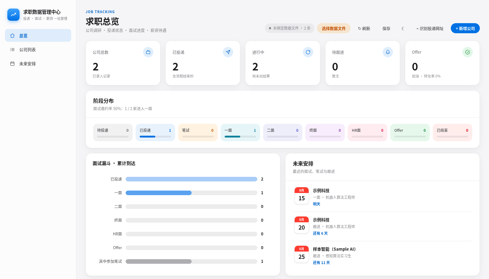
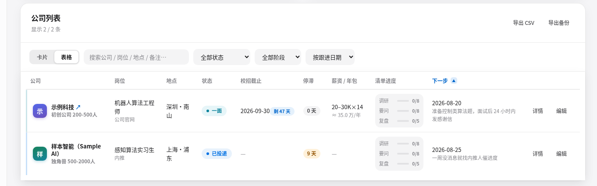
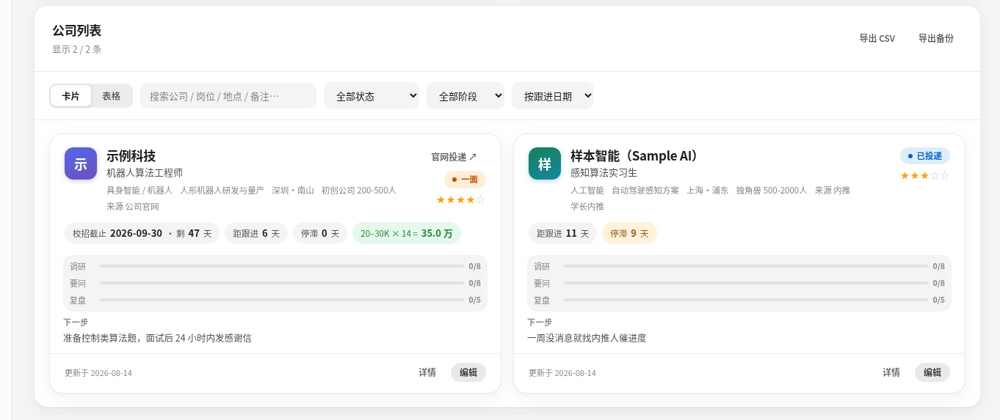

# 求职数据管理中心

本地优先的秋招 / 求职投递管理器：公司调研、投递状态、面试进度、薪资对比一站管理。
单个 HTML 文件 + 零依赖 Node 静态服务，数据只存在本机的 `data.json` 里——无账号、不上传、拷走一个 JSON 文件就是全部数据。

## 界面预览



### 公司列表 · 表格视图

按容器宽度自动收起次要列，任何窗口宽度都不需要横向滚动。



### 公司列表 · 卡片视图



## 功能

- **总览仪表盘**：公司总数 / 已投递 / 进行中 / 待跟进 / Offer 五张统计卡，九阶段分布图，面试漏斗，未来安排提醒
- **公司列表**：表格和卡片两种视图，全文搜索、按状态与阶段筛选、任意列排序；表格按容器宽度自动收起次要列，任何窗口宽度都无需横向滚动
- **单公司档案**：投递与各轮面试时间线、薪资年包自动估算、优劣势对比、公司调研 / 要问 HR / 面试复盘三张清单
- **实时写回**：改动半秒内写回 `data.json`，每 1.5 秒检测外部改动并热更新，带乐观锁冲突提示
- **误删可恢复**：删除的记录进「最近删除」回收站，保留 30 天，可随时恢复或彻底删除
- **一键收录**：配套浏览器插件（`browser-extension/`），粘贴岗位网址自动识别公司、岗位、投递日期、状态和城市
- **深色 / 浅色主题**：一键切换，全站配色统一校准，跟随系统「减弱动态效果」设置

## 快速开始

需要 [Node.js](https://nodejs.org)（仅用内置模块，无需 `npm install`）和 Chrome / Edge 浏览器。

```bash
# 1. 用示例数据初始化（data.json 是个人数据，不入库）
cp data.example.json data.json

# 2. 启动
./启动.sh          # Linux / macOS
# 或双击 启动.bat   # Windows
```

服务起在 <http://localhost:8000> 并自动打开浏览器。

> **为什么不能直接双击 index.html？** file:// 页面拿不到浏览器的文件读写权限，
> 自动读取和实时写回都会失效，必须通过 localhost 打开。

## 数据与隐私

- 全部数据只写进同目录的 `data.json`，已在 `.gitignore` 中排除，**不会**被提交到仓库
- 换电脑 / 移动文件夹：把 `data.json` 一起拷走即可
- 「导出 CSV」「导出备份」按钮可随时导出全量数据

## 浏览器插件（可选）

`browser-extension/` 是 Chrome / Edge 的 MV3 扩展：在招聘网站岗位页点插件图标，自动识别岗位信息并跳回管理器预填表单。安装步骤见 [browser-extension/安装说明.txt](browser-extension/安装说明.txt)。

> 若把管理器部署到自己的域名 / GitHub Pages，需同步修改
> `browser-extension/manifest.json` 中 `content_scripts.matches` 的地址列表。

## 项目结构

```text
├── index.html            # 应用本体（界面 + 全部逻辑，无外部依赖）
├── server.js             # 本地静态服务 + data.json 读写接口（Node 内置模块）
├── 启动.sh / 启动.bat     # Linux/macOS 与 Windows 启动脚本
├── data.example.json     # 示例数据（复制为 data.json 使用）
├── browser-extension/    # 一键收录浏览器扩展（MV3，可选安装）
└── docs/                 # README 截图
```

## 快捷键

| 按键 | 功能 |
| --- | --- |
| `N` | 新增公司 |
| `Ctrl/⌘ + S` | 立即保存 |
| `Ctrl/⌘ + R` | 从数据文件重新读取 |
| `Esc` | 关闭弹窗 |
